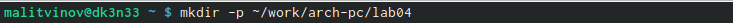
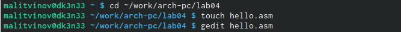
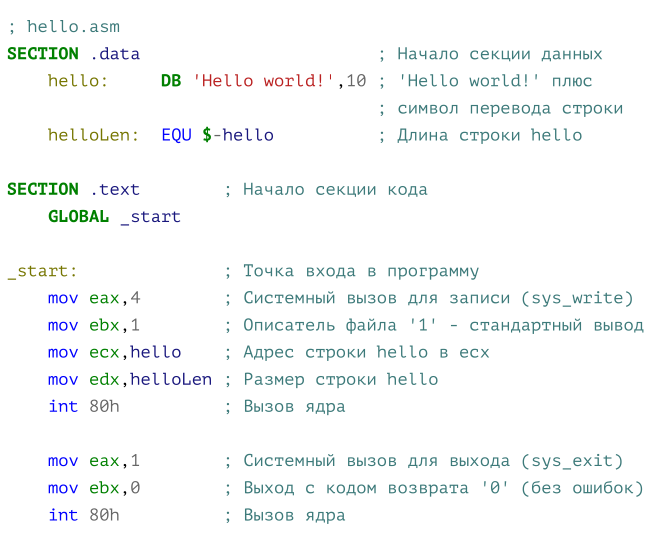
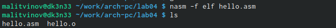
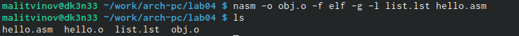
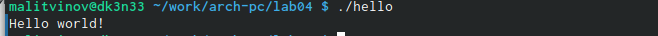
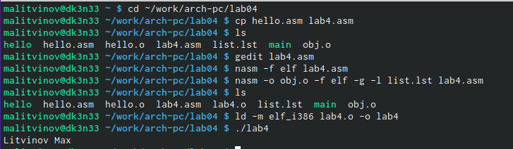

---
## Front matter
title: "Отчет по лабораторной работе №4"
subtitle: "Дисциплина: архитектура компьютера"
author: "Литвинов Максим Андреевич"

## Generic otions
lang: ru-RU
toc-title: "Содержание"

## Bibliography
bibliography: bib/cite.bib
csl: pandoc/csl/gost-r-7-0-5-2008-numeric.csl

## Pdf output format
toc: true # Table of contents
toc-depth: 2
lof: true # List of figures
lot: true # List of tables
fontsize: 12pt
linestretch: 1.5
papersize: a4
documentclass: scrreprt
## I18n polyglossia
polyglossia-lang:
  name: russian
  options:
	- spelling=modern
	- babelshorthands=true
polyglossia-otherlangs:
  name: english
## I18n babel
babel-lang: russian
babel-otherlangs: english
## Fonts
mainfont: PT Serif
romanfont: PT Serif
sansfont: PT Sans
monofont: PT Mono
mainfontoptions: Ligatures=TeX
romanfontoptions: Ligatures=TeX
sansfontoptions: Ligatures=TeX,Scale=MatchLowercase
monofontoptions: Scale=MatchLowercase,Scale=0.9
## Biblatex
biblatex: true
biblio-style: "gost-numeric"
biblatexoptions:
  - parentracker=true
  - backend=biber
  - hyperref=auto
  - language=auto
  - autolang=other*
  - citestyle=gost-numeric
## Pandoc-crossref LaTeX customization
figureTitle: "Рис."
tableTitle: "Таблица"
listingTitle: "Листинг"
lofTitle: "Список иллюстраций"
lotTitle: "Список таблиц"
lolTitle: "Листинги"
## Misc options
indent: true
header-includes:
  - \usepackage{indentfirst}
  - \usepackage{float} # keep figures where there are in the text
  - \floatplacement{figure}{H} # keep figures where there are in the text
---

# Цель работы

Целью работы является изучение принципа создания и процесса обработки программ на языке ассемлебра NASM

# Задание

1. Создание каталога для работы программы на языке ассемблера NASM
2. Код программы в файле hello.asm
3. Компиляция программы Hello World
4. Для получения исполняемой программы необходимо передать файл компоновщику
5. Запуск исполняемого файла

# Теоретическое введение

Процессор способен понимать лишь машинные коды, преобразованием команд с языка ассемблера в исполняемый машинный код занимается специальная программа транслятор - Ассемблер. 

В процессе создания ассемблерной программы можно выделить четыре шага:
	• Набор текста программы в текстовом редакторе и сохранение её в отдельном файле.
	• Трансляция — преобразование с помощью транслятора, например nasm, текста про-
граммы в машинный код, называемый объектным.
	• Компоновка — этап обработки объектного кода компоновщиком,
который принимает на вход объектные файлы и собирает по ним исполняемый файл.
	• Запуск программы. Конечной целью является работоспособный исполняемый файл.

# Выполнение лабораторной работы

Создание каталога для работы с программой на языке ассемблера NASM (рис. [-@fig:001]).

{ #fig:001 width=70% }

Переход в созданный каталог и создание, открытие текстового файла hello.asm (рис. [-@fig:002]).

{ #fig:002 width=70% }

Ввод программы (рис. [-@fig:003]).

{ #fig:003 width=70% }

Компиляции приведённого выше текста программы «Hello World» (рис. [-@fig:004]).

{ #fig:004 width=70% }

Компиляция исходного файла hello.asm в obj.o (рис. [-@fig:005]).

{ #fig:005 width=70% }

Передача объектного файла на обработку компоновщику (рис. [-@fig:006]).

{ #fig:006 width=70% }

Запуск исполняемого файла (рис. [-@fig:007]).

{ #fig:007 width=70% }

Выполнение заданий для самостоятельной работы аналогично предыдущим пунктам (рис. [-@fig:008]).

{ #fig:008 width=70% }

# Выводы

Выполняя лабораторную работу, я приобрел практические навыки работы с языком ассемблера NASM

# Список литературы{.unnumbered}

::: {#refs}
:::
