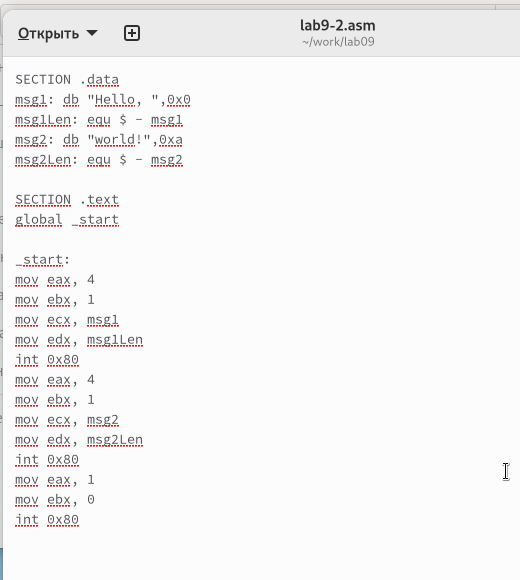

---
## Front matter
title: "Отчет по лабораторной работе №9"
subtitle: "Дисциплина: Архитектура компьютерных наук"
author: "Литвинов Максим Андреевич"

## Generic otions
lang: ru-RU
toc-title: "Содержание"

## Bibliography
bibliography: bib/cite.bib
csl: pandoc/csl/gost-r-7-0-5-2008-numeric.csl

## Pdf output format
toc: true # Table of contents
toc-depth: 2
lof: true # List of figures
lot: true # List of tables
fontsize: 12pt
linestretch: 1.5
papersize: a4
documentclass: scrreprt
## I18n polyglossia
polyglossia-lang:
  name: russian
  options:
	- spelling=modern
	- babelshorthands=true
polyglossia-otherlangs:
  name: english
## I18n babel
babel-lang: russian
babel-otherlangs: english
## Fonts
mainfont: PT Serif
romanfont: PT Serif
sansfont: PT Sans
monofont: PT Mono
mainfontoptions: Ligatures=TeX
romanfontoptions: Ligatures=TeX
sansfontoptions: Ligatures=TeX,Scale=MatchLowercase
monofontoptions: Scale=MatchLowercase,Scale=0.9
## Biblatex
biblatex: true
biblio-style: "gost-numeric"
biblatexoptions:
  - parentracker=true
  - backend=biber
  - hyperref=auto
  - language=auto
  - autolang=other*
  - citestyle=gost-numeric
## Pandoc-crossref LaTeX customization
figureTitle: "Рис."
tableTitle: "Таблица"
listingTitle: "Листинг"
lofTitle: "Список иллюстраций"
lotTitle: "Список таблиц"
lolTitle: "Листинги"
## Misc options
indent: true
header-includes:
  - \usepackage{indentfirst}
  - \usepackage{float} # keep figures where there are in the text
  - \floatplacement{figure}{H} # keep figures where there are in the text
---

# Цель работы

Целью работы является приобретение навыков написания программ с использованием подпрограмм.
Знакомство с методами отладки при помощи GDB и его основными возможностями.

# Выполнение лабораторной работы

## Реализация подпрограмм в NASM

Я создал каталог, предназначенный для выполнения лабораторной работы №9, 
и перешел в него. 

В рамках примера рассмотрим программу, которая вычисляет арифметическое 
выражение $f(x) = 2x+7$ с использованием подпрограммы calcul. 
В данном примере значение переменной $x$ вводится с клавиатуры, 
а само выражение вычисляется внутри подпрограммы.

{ #fig:001 width=70%, height=70% }

Первые строки программы отвечают за вывод сообщения на экран 
с использованием функции sprint, чтение данных, введенных с клавиатуры 
с помощью функции sread, и преобразование введенных данных из символьного 
в числовой формат с помощью функции atoi.

После инструкции call _calcul, которая передает управление подпрограмме
 _calcul, выполнение программы переходит к инструкциям, 
 содержащимся внутри подпрограммы.
 
Инструкция ret является последней в подпрограмме и ее выполнение приводит 
к возврату в основную программу к инструкции, следующей за инструкцией call, 
которая вызвала данную подпрограмму.

Внесены изменения в текст программы, добавлена подпрограмма subcalcul 
внутри подпрограммы calcul для вычисления выражения $f(g(x))$, 
где значение $x$ вводится с клавиатуры, $f(x) = 2x + 7$, $g(x) = 3x - 1$.

{ #fig:002 width=70%, height=70% }

Изменил текст программы, добавив подпрограмму subcalcul в подпрограмму calcul, 
для вычисления выражения $f(g(x))$, где $x$ вводится с клавиатуры, 
$f(x) = 2x + 7, g(x) = 3x − 1$.

{ #fig:003 width=70%, height=70% }

{ #fig:004 width=70%, height=70% }

## Отладка программам с помощью GDB

Я создал файл с именем lab9-2.asm, в котором содержится текст программы 
из Листинга 9.2, реализующей функцию печати сообщения "Hello world!".

{ #fig:005 width=70%, height=70% }

После компиляции получил исполняемый файл. 
Чтобы использовать отладчик GDB, я добавил отладочную информацию к 
исполняемому файлу, указав ключ "-g" при компиляции.

Затем я загрузил исполняемый файл в отладчик GDB и проверил его работу, 
запустив программу с помощью команды 
"run" (или "r" в сокращенной форме).

{ #fig:006 width=70%, height=70% }

Для более детального анализа программы я установил точку остановки на метке 
"start", с которой начинается выполнение любой ассемблерной программы, 
и запустил ее. 
Затем я просмотрел дизассемблированный код программы.

{ #fig:007 width=70%, height=70% }

{ #fig:008 width=70%, height=70% }

Чтобы установить точку остановки, я использовал команду "break" 
(или "b" в сокращенной форме). Типичным аргументом для этой команды может 
быть номер строки программы, имя метки или адрес. Чтобы избежать путаницы 
с номерами, перед адресом ставится знак "*".

На предыдущих шагах я уже установил точку остановки по имени метки "_start" 
и проверил это с помощью команды "info breakpoints" (или "i b" в сокращенной 
форме). Затем я установил еще одну точку остановки по адресу инструкции, 
определив адрес предпоследней инструкции "mov ebx, 0x0".

{ #fig:009 width=70%, height=70% }

Я использовал отладчик, который позволяет просматривать 
содержимое ячеек памяти и регистров, а также вносить в них изменения 
при необходимости. Я выполнил 5 инструкций с помощью команды stepi (или si) 
и следил за изменениями значений регистров.

{ #fig:010 width=70%, height=70% }

{ #fig:011 width=70%, height=70% }

Далее я просмотрел значение переменной msg1, обратившись к ней по имени. 
Также я посмотрел значение переменной msg2, обратившись к ней по адресу.

Для изменения значения регистра или ячейки памяти я использовал команду set, 
указав в качестве аргумента имя регистра или адрес. 
Я изменил первый символ переменной msg1.

{ #fig:012 width=70%, height=70% }

Для вывода значения регистра edx в различных форматах 
(шестнадцатеричном, двоичном и символьном) я использовал соответствующие команды.

{ #fig:013 width=70%, height=70% }

С помощью команды set также изменил значение регистра ebx.

{ #fig:014 width=70%, height=70% }

Я скопировал файл lab8-2.asm, созданный в ходе выполнения лабораторной работы №8, 
который выводит аргументы командной строки, и создал исполняемый файл. 
Для загрузки программы с аргументами в отладчик GDB использовал ключ --args, 
указав соответствующие аргументы. Затем установил точку остановки перед 
первой инструкцией в программе и запустил ее.

{ #fig:015 width=70%, height=70% }

Адрес вершины стека хранится в регистре esp, и по этому адресу располагается 
число, равное количеству аргументов командной строки, включая имя программы. 
В данном случае число аргументов равно 5: имя программы lab9-3 и аргументы: 
аргумент1, аргумент2 и 'аргумент 3'.

Я также просмотрел остальные позиции стека. 
По адресу [esp+4] находится адрес в памяти, где хранится имя программы, 
по адресу [esp+8] хранится адрес первого аргумента, по адресу [esp+12] - 
второго и так далее.

{ #fig:016 width=70%, height=70% }

Объясню, почему шаг изменения адреса равен 4 ([esp+4], [esp+8], [esp+12]). 
Это связано с тем, что шаг равен размеру переменной, который составляет 4 байта.

## Задание для самостоятельной работы

Я внес изменения в программу из лабораторной работы №8, чтобы вычислить значение функции f(x) 
в виде подпрограммы.

{ #fig:017 width=70%, height=70% }

{ #fig:018 width=70%, height=70% }

Ниже приведен исправленный листинг программы, который вычисляет 
выражение $(3+2)*4+5$. 
Однако, при запуске, программа дает неверный результат. 
Я решил использовать отладчик GDB для анализа изменений значений 
регистров и определения ошибки.

{ #fig:019 width=70%, height=70% }

{ #fig:020 width=70%, height=70% }

В процессе отладки я заметил, что порядок аргументов в инструкции 
add был перепутан, и что при завершении работы, вместо eax, значение 
отправлялось в edi. 

Вот исправленный код программы:

{ #fig:021 width=70%, height=70% }

{ #fig:022 width=70%, height=70% }

# Выводы

Освоили работy с подпрограммами и отладчиком.